<div align="center">


# 📡 findphone X — Bluetooth Signal-Strength Device Finder

### *Locate a nearby Bluetooth device by RSSI — clean architecture, real filtering, real tests*

[](https://flutter.dev)
[](https://dart.dev)
[](https://riverpod.dev)
[](https://drift.simonbinder.eu)
[](LICENSE)
[](http://makeapullrequest.com)

**Scan • Filter • Estimate • Guide**

[Features](#-features) • [Installation](#️-installation) • [Quick Start](#-quick-start) • [Project Structure](#-project-structure) • [CI/CD](#-cicd) • [Contributing](#-contributing)

</div>

---

## 📖 Overview

**findphone X** is a mobile tool for locating a nearby Bluetooth device by its signal strength — built for the case where Find My or an equivalent is unavailable (for example, a device enrolled in MDM), but the device is still within Bluetooth range and you just need to know which corner of the room it's in.

Originally a macOS command-line tool built on CoreBluetooth, findphone was rebuilt from the ground up as a Flutter app with clean architecture, a real Kalman filter for signal smoothing, a path-loss model for distance estimation, local persistence, and background scanning — not just a UI port.

<div align="center">

### 🎯 **Why This Tool?**

| **Real Filtering** | **Clean Architecture** | **Persisted History** | **Background Aware** |
|:---:|:---:|:---:|:---:|
| Kalman filter, not a raw average | domain/data/presentation, fully testable | Drift/SQLite, not just in-memory | Keeps scanning while minimized |

</div>

---

## ✨ Features

### 📡 Survey Mode — every nearby Apple/BLE handheld


Walk slowly and watch the list — the device that climbs as you approach a spot is the one you're after. Sorted live by smoothed RSSI, with a proximity band per row.

---

### 🎯 Hunt Mode — track one device by name

```mermaid
graph LR
    A[Advertisement matched by name] --> B[Reading History]
    B --> C[Kalman Filter]
    C --> D[Path-Loss Model]
    D --> E[dBm + Estimated Meters]
    B --> F[Trend: warmer / colder / steady]

    style A fill:#1c2130
    style E fill:#331a00
    style F fill:#1a3320
```



- **Live dBm reading** — median of the last 4 seconds, so a single reflected spike can't move the number
- **Estimated distance in meters** — from a configurable path-loss model (`measuredPowerAt1m`, `pathLossExponent`)
- **Trend indicator** — ▲ warmer / ▼ colder / · steady, comparing a near window against a wider one
- **Sparkline** — last 44 readings, one bar per measurement
- **Optional proximity clicks** — faster as you get closer, parking-sensor style, silent when contact is stale

#### 🎚️ Proximity Bands

| dBm | Meaning |
|---|---|
| -45 and up | Arm's reach |
| -60 | Same table |
| -72 | Same room |
| -85 | Far / behind something |
| below | Very far or shielded |

---

### 🗂 Paired Devices Tab

Lists bonded and system-known Bluetooth devices with live connection state — a quick reference for picking a target name to hunt.

### 🕶 Redact Mode

Masks Bluetooth addresses and, in survey mode, falls back to device kind instead of name — for screen recording. Distance and trend stay visible; addresses do not.

### 📊 Local History (Drift/SQLite)

Every matched reading in hunt mode is persisted per device, not just held in memory — enabling later analysis, trend graphs across sessions, or export.

<details>
<summary><b>Sample stored reading</b></summary>

```
device_key: 3F1A-...-9C2E
rssi: -63
distance_meters: 3.8
source: advert
at: 2026-08-10T14:23:04Z
```

</details>

### 🛡 Safety & Control

- **Thread-safe scanning** — all BLE work runs off the widget tree via Riverpod providers; UI never blocks
- **Background scanning** — `flutter_foreground_task` keeps the scan alive on Android while the app is minimized
- **Permission-aware** — clear prompts for Bluetooth scan/connect and location, with a readable radio-state message when Bluetooth is off

---

## 🛠️ Installation

### Prerequisites

```
Flutter  >= 3.9
Dart     >= 3.3
Android Studio / Xcode toolchains for the target platform
```

### Setup

```bash
# 1. Clone the repository
git clone https://github.com/yourusername/findphone.git
cd findphone

# 2. Install dependencies
flutter pub get

# 3. Generate Drift + Riverpod code
dart run build_runner build --delete-conflicting-outputs

# 4. Add the click sound
#    place a short mp3 at assets/sounds/tink.mp3

# 5. Run
flutter run
```

<details>
<summary><b>Platform Notes</b></summary>

**Android:**
- `BLUETOOTH_SCAN`, `BLUETOOTH_CONNECT`, `ACCESS_FINE_LOCATION` required in the manifest
- Background scanning additionally needs `FOREGROUND_SERVICE`, `FOREGROUND_SERVICE_LOCATION`, `POST_NOTIFICATIONS`

**iOS:**
- `NSBluetoothAlwaysUsageDescription` and `NSBluetoothPeripheralUsageDescription` required in `Info.plist`
- `bluetooth-central` background mode needed for scanning while backgrounded

</details>

---

## 🚀 Quick Start

### Survey nearby devices

1. **Launch the app**
   ```bash
   flutter run
   ```
2. Leave the device-name field empty
3. Tap **Search all devices**
4. Walk slowly — the row that climbs as you approach a spot is your target

### Hunt a specific device

1. Enter a device name (case-insensitive match against advertised names)
2. Optionally enable **Sound** for proximity clicks
3. Tap **Track this device**
4. Watch the big dBm number, estimated distance, and trend arrow as you move

---

## 📂 Project Structure

```
findphone/
├── lib/
│   ├── main.dart                    # Entry point — ProviderScope + MaterialApp
│   │
│   ├── core/                        # Pure logic, no Flutter dependency
│   │   ├── kalman_filter.dart       # 1D Kalman filter for RSSI smoothing
│   │   └── path_loss.dart           # Path-loss model → estimated distance
│   │
│   ├── domain/                      # Framework-independent domain layer
│   │   ├── entities/                # Reading, Advertiser, Proximity, TrackerSnapshot
│   │   ├── repositories/            # BleRepository, HistoryRepository (abstract)
│   │   └── usecases/                # TrackDevice, GetPairedDevices, AnalyzeSignal
│   │
│   ├── data/                        # Real implementations
│   │   ├── local/app_database.dart  # Drift (SQLite) schema
│   │   └── repositories/            # BleRepositoryImpl, HistoryRepositoryImpl
│   │
│   ├── application/providers/       # Riverpod providers — DI and state
│   │
│   ├── presentation/
│   │   ├── screens/                 # Home · Survey · Hunt · PairedDevices
│   │   └── widgets/                 # BigNumber · SignalBar · Sparkline
│   │
│   └── services/                    # Clicker (sound), BackgroundScanService, Permissions
│
├── test/                            # Unit tests — core, domain, data
├── .github/workflows/               # ci.yml · release.yml
└── pubspec.yaml
```

### Architecture Overview

**`core/`**
- `KalmanFilter1D` — smooths noisy RSSI without the lag of a plain moving average
- `PathLossModel` — converts a smoothed RSSI into an estimated distance in meters, with `openSpace` and `indoorCluttered` presets

**`domain/`**
- Entities carry no Flutter or BLE dependency — testable in plain Dart
- `BleRepository` / `HistoryRepository` are abstract, so the data layer can be swapped or mocked

**`data/`**
- `BleRepositoryImpl` — wraps `flutter_blue_plus`, emits a `TrackerSnapshot` stream
- `HistoryRepositoryImpl` — wraps Drift, persists every matched reading per device

**`application/providers/`**
- `trackerSnapshotProvider` — `StreamProvider.family` keyed by target device name
- `clickerControllerProvider`, `appSettingsProvider`, `pairedDevicesProvider`

**`presentation/`**
- `ConsumerWidget` screens driven entirely by provider state — no direct BLE calls from the UI

---

## ⚙️ CI/CD

Two workflows in `.github/workflows/`:

| Workflow | Trigger | What it does |
|---|---|---|
| **ci.yml** | push / PR | format check, `flutter analyze`, tests with coverage, debug APK build, unsigned iOS build |
| **release.yml** | tag `v*` | signed release APK + AAB, published as a GitHub Release |

<details>
<summary><b>Release secrets required</b></summary>

| Secret | Description |
|---|---|
| `ANDROID_KEYSTORE_BASE64` | `base64 -i release.keystore` output |
| `ANDROID_STORE_PASSWORD` | Keystore password |
| `ANDROID_KEY_PASSWORD` | Key password |
| `ANDROID_KEY_ALIAS` | Key alias |

</details>

---

## 🐛 Troubleshooting

<details>
<summary><b>Bluetooth permission denied</b></summary>

Grant Bluetooth and location permissions from system settings, then relaunch the app. The scan won't start without both on Android.

</details>

<details>
<summary><b>No contact with the target device</b></summary>

If this persists, the device is likely powered off, out of range (roughly 10–20 m indoors), or shielded inside something metal — a filing cabinet reads about the same as open air fifteen meters away.

</details>

<details>
<summary><b>Distance estimate looks off</b></summary>

RSSI-based distance is a coarse proxy — walls, bodies, and metal attenuate it heavily. Trust the trend arrow as you move rather than any single meter figure; switching between the `openSpace` and `indoorCluttered` presets in `PathLossModel` can help calibrate to your environment.

</details>

<details>
<summary><b>Background scan stops on Android</b></summary>

Some OEM battery-optimization settings kill foreground services aggressively. Whitelist the app under battery settings if scanning stops while backgrounded.

</details>

<details>
<summary><b>Build fails after pulling changes</b></summary>

Drift and Riverpod generate code that can go stale:
```bash
dart run build_runner build --delete-conflicting-outputs
```

</details>

---

## 🤝 Contributing

Contributions are welcome! Here's how to get started:

```bash
# 1. Fork the repository on GitHub

# 2. Clone your fork
git clone https://github.com/YOUR_USERNAME/findphone.git

# 3. Create a feature branch
git checkout -b feature/your-feature-name

# 4. Make your changes and commit
git commit -m "Add: description of your change"

# 5. Push and open a Pull Request
git push origin feature/your-feature-name
```

### Areas to Contribute

| Area | Ideas |
|------|-------|
| 📡 **Scanning** | iOS background scan refinements, BLE mesh handling |
| 🗜️ **Filtering** | Adaptive Kalman parameters, per-device calibration |
| 🎨 **UI** | Compass-style bearing hints, haptic feedback |
| 🌐 **i18n** | Full localization beyond Persian strings |
| 🧪 **Tests** | Widget tests for hunt/survey screens |
| 📖 **Docs** | Calibration guide for `PathLossModel` |

---

## 📄 License

This project is licensed under the **MIT License**. See the [LICENSE](LICENSE) file for details.

---

## 🙏 Acknowledgments

<div align="center">

### Built With Flutter, Riverpod & Drift

[](https://flutter.dev)
[](https://riverpod.dev)
[](https://drift.simonbinder.eu)

### Special Thanks To

**flutter_blue_plus maintainers** | **Flutter Community** | **Open Source Contributors**
:---: | :---: | :---:
Reliable cross-platform BLE scanning | Amazing ecosystem and tooling | Riverpod, Drift, flutter_foreground_task and more

</div>

---

<div align="center">


### ✨ **Built for the moment you're standing in the doorway wondering where it is** ✨

</div>
